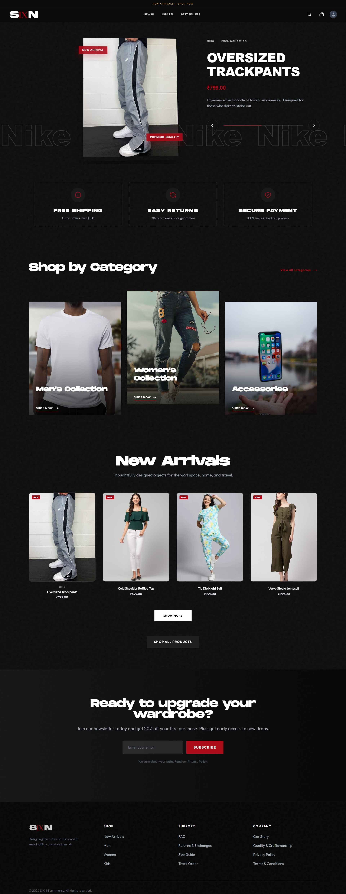
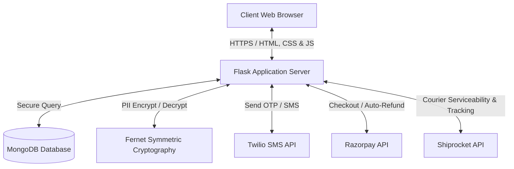

# SIXN | Premium E-Commerce Storefront



SIXN is a premium, feature-rich, and highly secure e-commerce storefront built with **Flask** and **MongoDB**. Designed for maximum visual impact, it integrates **Twilio OTP** authentication, **Razorpay** payment gateway, a **custom Wallet system** for store credit, and **Shiprocket** automated shipping logistics.

---

## Table of Contents
- [Key Features](#key-features)
- [System Architecture](#system-architecture)
- [Tech Stack](#tech-stack)
- [Environment Configuration](#environment-configuration)
- [Installation & Local Setup](#installation--local-setup)
- [Project Directory Structure](#project-directory-structure)
- [Security & PII Data Protection](#security--pii-data-protection)
- [License](#license)

---

## Key Features

### 🌟 Immersive Frontend Experience
*   **Dynamic Product Showcase**: Responsive sliding hero catalog with custom keyboard/mouse transition controls.
*   **Integrated Cart Drawer**: Accessible side panel cart with real-time subtotal and discount logic.
*   **Clean Design Language**: Curated typography (Syne & Space Grotesk), dark mode aesthetics, and micro-interactions.

### 🔐 Passwordless SMS Authentication
*   **Twilio OTP Integration**: Seamless phone-number sign-up and login utilizing SMS verification.
*   **Robust Session Management**: Secure user sessions powered by Flask-Login and bcrypt password-hashing.

### 💳 Payments & Checkout Ecosystem
*   **Razorpay Gateway Integration**: Direct prepaid checkout flow with signature verification to prevent order tampering.
*   **Custom Store Wallet**: Users can earn store credit, check transaction logs, and perform full or split payments (Wallet + Razorpay).
*   **Automated Cancellations & Refunds**: Cancelling a prepaid order automatically triggers an instant refund request back to the customer's payment source.

### 🚚 Automated Shipping (Shiprocket Integration)
*   **Serviceability Checks**: Real-time pin code verification before checkout to check courier availability.
*   **Smart Courier Selection**: Selects the best courier partner based on shipping rates, pickup speeds, and delivery estimates.
*   **Automated Consignment Creation**: Automates order creation, schedules courier pick-up, and generates shipping labels from the admin panel.
*   **Live Tracking**: Customers can check live tracking logs and shipment updates directly from their user dashboard.

### 📊 Full-Scale Admin Control Center
*   **Sales & Product Analytics**: High-level charts tracking total users, orders, revenue, and product stock counts.
*   **Catalog & Inventory Editor**: Add, edit, or remove products, manage variant sizes, upload images, and control stock status.
*   **Custom Coupon Generator**: Create percentage or fixed-discount coupon codes with min-spend rules.
*   **Order Orchestration**: Dispatch orders, download shipping invoices, create pickups, or cancel shipments.
*   **Review & Flag Moderation**: Inspect reviews, filter flagged items, and manage customer ratings.

---

## System Architecture

The following diagram illustrates how the core application server interfaces with MongoDB and third-party APIs:



---

## Tech Stack

*   **Backend Framework**: Python (Flask)
*   **Authentication & Security**: Flask-Login, Flask-Bcrypt, Flask-Limiter, Cryptography (Fernet)
*   **Database**: MongoDB (via PyMongo)
*   **Payment Processing**: Razorpay SDK
*   **SMS Gateway**: Twilio SDK
*   **Logistics Engine**: Shiprocket REST API
*   **Frontend Technologies**: HTML5, Vanilla CSS, JS (ES6), TailwindCSS

---

## Environment Configuration

Configure the project by creating a `.env` file in the root directory (use `.env.example` as a template):

| Key | Description | Example / Value |
| :--- | :--- | :--- |
| `SECRET_KEY` | Flask session cookie encryption key | `a_highly_secure_random_string` |
| `MONGO_URI` | Connection URI for the MongoDB database | `mongodb://localhost:27017/sixn` |
| `RAZORPAY_KEY` | Razorpay Merchant Key ID | `rzp_test_xxxxxxxxxxxxxx` |
| `RAZORPAY_SECRET` | Razorpay Merchant Key Secret | `xxxxxxxxxxxxxxxxxxxxxxxx` |
| `TWILIO_PHONE` | Twilio purchased virtual phone number | `+1xxxxxxxxxx` |
| `TWILIO_SID` | Twilio Account SID | `ACxxxxxxxxxxxxxxxxxxxxxxxxxxxxxxxx` |
| `TWILIO_TOKEN` | Twilio Auth Token | `xxxxxxxxxxxxxxxxxxxxxxxxxxxxxxxx` |
| `ADMIN_USER_ID` | MongoDB UUID of the system administrator account | `user-uuid-xxxx-xxxx` |
| `SHIPROCKET_EMAIL`| Shiprocket merchant email | `admin@sixn.com` |
| `SHIPROCKET_PASSWORD`| Shiprocket merchant password | `password123` |
| `SHIPROCKET_PICKUP_LOCATION`| Pickup warehouse name configured in Shiprocket | `Primary` |
| `SHIPROCKET_PICKUP_PINCODE`| Pincode of the pickup warehouse | `110046` |
| `ENCRYPTION_KEY` | Symmetric Fernet key for general database encryption | Base64 URL-safe key |
| `PHONE_ENCRYPTION_KEY`| Symmetric Fernet key for encrypting user phone numbers| Base64 URL-safe key |
| `ADDRESS_ENCRYPTION_KEY`| Symmetric Fernet key for encrypting user addresses | Base64 URL-safe key |

> [!TIP]
> You can generate secure Fernet encryption keys by running the following command in your terminal:
> ```bash
> python -c "from cryptography.fernet import Fernet; print(Fernet.generate_key().decode())"
> ```

---

## Installation & Local Setup

### 1. Prerequisites
Ensure you have the following installed on your system:
*   [Python 3.8+](https://www.python.org/downloads/)
*   [MongoDB Community Server](https://www.mongodb.com/try/download/community) (running locally on port `27017`)

### 2. Clone the Repository
```bash
git clone https://github.com/madebyparth/sixn
cd sixn
```

### 3. Create a Virtual Environment
```bash
# Windows
python -m venv venv
venv\Scripts\activate

# macOS / Linux
python3 -m venv venv
source venv/bin/activate
```

### 4. Install Dependencies
```bash
pip install -r requirements.txt
```

### 5. Configure Environment Variables
Copy `.env.example` to `.env` and fill in your actual credentials:
```bash
cp .env.example .env
```

### 6. Initialize & Seed MongoDB (Database Setup)
Since you are setting up the project with a fresh local MongoDB database, your database will initially be completely empty. If you start the app at this stage, the storefront will have no products, no collections, and no layout banners, resulting in a blank or malfunctioning UI.

To bootstrap your database with default demo data, run the migration seeding script:
```bash
python migrate_to_mongo.py
```

**What this script does:**
*   **Populates Showcase Catalog**: It reads default catalog products from `assets/products.json` and writes them into your local MongoDB `products` collection, seeding your store with items out-of-the-box.
*   **Configures Homepage Layout**: It imports homepage layout configs (slider details, meta banners) from `assets/content.json` to establish default themes and styling.
*   **Initializes Collection Schemas**: It boots empty structures for operational databases (users, orders, ratings, OTP keys, coupons, notifications) so your backend can query and record transactions immediately.

### 7. Run the Application
Start the Flask development server:
```bash
python app.py
```
Open your browser and navigate to `http://127.0.0.1:5000`.

---

## Project Directory Structure

```text
├── assets/                  # Static design and database seed resources
│   ├── user-media/          # User default profile placeholders
│   ├── web-media/           # Store theme assets and visual logos
│   ├── content.json         # Seeding layout data for MongoDB
│   ├── products.json        # Seeding product catalog data for MongoDB
│   └── website.png          # Main repository banner / screenshot
├── services/                # Integration microservices
│   ├── data/                # Temporary service cache files (git-ignored)
│   └── shiprocket_service.py # Shiprocket API courier service handler
├── static/                  # Client-side static assets
│   └── uploads/             # User and product media uploads (git-ignored)
├── templates/               # Jinja2 HTML templates
│   ├── base.html            # Main wrapper, navigation, drawer components
│   ├── index.html           # Brand landing page & sliding showcase
│   ├── product.html         # Detailed variant view, inventory checks & reviews
│   ├── checkout.html        # Coupons, wallet splits, Razorpay gateway triggers
│   └── admin.html           # Full storefront catalog and sales dashboard
├── utils/                   # Shared utility modules
│   ├── db.py                # PyMongo engine and JSON migration drivers
│   └── security.py          # PII Field encryption and data anonymization
├── .env.example             # Configuration settings template
├── .gitignore               # Excludes secrets, uploads, and caches
├── LICENSE                  # MIT open-source license
├── app.py                   # Central Flask controller, middleware and route handlers
├── migrate_to_mongo.py      # Database bootstrap initialization script
└── requirements.txt         # Project package dependencies
```

---

## Security & PII Data Protection

To comply with modern user privacy standards, SIXN incorporates **Fernet symmetric data encryption** via the Python `cryptography` library. 
*   All user **phone numbers**, **shipping addresses**, and **billing addresses** are automatically encrypted before being written to MongoDB.
*   Data is decrypted transparently on reading, ensuring that even in the event of a database dump or leakage, user PII remains entirely secure and unreadable.
*   Make sure to keep your `ENCRYPTION_KEY`, `PHONE_ENCRYPTION_KEY`, and `ADDRESS_ENCRYPTION_KEY` backed up securely. If these keys are lost, existing encrypted user profiles cannot be decrypted.

---

## License

This project is licensed under the MIT License - see the [LICENSE](LICENSE) file for details.
